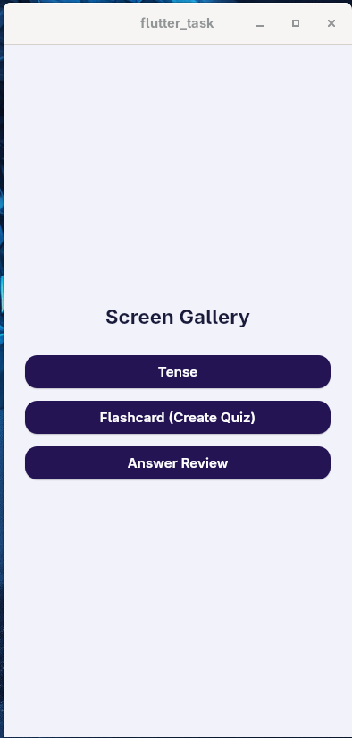

# Flutter Quiz App — Screen Gallery

A Flutter UI task project showcasing three polished quiz-related screens built with **Flutter Riverpod** for state management and **Material 3** theming. The app serves as a screen gallery where each screen can be navigated to independently for review and testing.

---

## Screens

### 1. Home Screen
A simple launcher screen with three navigation buttons, one for each feature screen.


### 2. Tense Screen
A scrollable list of exam cards for tense-related tests.

- Live search bar that filters exams by title in real time
- Each **ExamCard** shows:
  - Exam title with a **Checked / Unchecked status badge**
  - Total marks, duration, total questions, and negative marks
  - Topic description with a "Show More" link
  - "View Questions" (outlined) and "Start Exam" / "Start Exam Again" (filled) action buttons
- Responsive horizontal padding for wide screens (> 600 px)

### 3. Flashcard (Quiz) Screen
An MCQ quiz screen with a countdown timer.

- Gradient purple **question card** displaying the current question
- **Level progress bar** with a red-to-purple gradient fill and a gradient-ringed `current/total` badge
- **Timer badge** showing a live mm:ss countdown (30-second auto-dispose timer)
- Tappable **option tiles** — selected option renders in solid purple with a white radio indicator; unselected tiles are white with a gray letter chip
- Pre-seeded selection state matches a design mockup

### 4. Answer Review Screen
A post-quiz review screen showing correct/wrong answers per question.

- Exam title header with a filter icon button
- Each **ReviewQuestionCard** (lavender background) contains:
  - Question text with its sequential number
  - Four **option rows** color-coded by status:
    - **Correct** — blue background, green letter avatar
    - **Wrong selected** — red background, red letter avatar
    - **Neutral** — white background, bordered letter avatar
  - Action buttons: **Comment**, **Answer**, **Explanation** (outlined green pills)
  - **Favorite toggle** heart button (red when favorited, green border when not)
- Favorite state is persisted in a Riverpod `StateNotifier` for the session

---

## Project Structure

```
lib/
├── main.dart                        # App entry point, ProviderScope, theme setup
├── core/
│   ├── theme/
│   │   ├── app_color.dart           # Centralized color palette
│   │   └── app_style.dart           # Reusable TextStyle constants
│   └── widgets/
│       ├── top_app_bar.dart          # Shared app bar (back, title, share, notifications)
│       └── icon_button_circle.dart   # Reusable circular icon button
├── data/
│   └── models/
│       ├── tense/
│       │   └── tense_exam_model.dart  # TenseExam data class + sample data
│       ├── quiz/
│       │   └── quiz_model.dart        # QuizQuestion data class + sample data
│       └── answer_review/
│           └── answer_model.dart      # ReviewQuestion, ReviewOption, ReviewOptionStatus
└── features/
    ├── home/
    │   └── home_screen.dart           # Screen gallery launcher
    ├── tense/
    │   ├── ui/tense_screen.dart
    │   ├── providers/tense_providers.dart  # Search query + filtered list providers
    │   └── widgets/
    │       ├── exam_card.dart
    │       ├── tense_search_bar.dart
    │       └── status_badge.dart
    ├── quiz/
    │   ├── ui/quiz_screen.dart
    │   ├── providers/quiz_providers.dart   # Selected option + countdown timer providers
    │   └── widgets/
    │       ├── quiz_question_card.dart
    │       ├── quiz_option_tile.dart
    │       ├── quiz_level_bar.dart
    │       └── quiz_timer_badge.dart
    └── answer_review/
        ├── ui/answer_review_screen.dart
        ├── providers/review_providers.dart  # Favorites StateNotifier
        └── widgets/
            ├── review_question_card.dart
            ├── review_option_row.dart
            └── review_action_buttons.dart
```

---

## State Management

The app uses [flutter_riverpod](https://pub.dev/packages/flutter_riverpod) (v3.3.2):

| Provider | Type | Purpose |
|---|---|---|
| `tenseSearchQueryProvider` | `StateProvider<String>` | Holds the live search text on the Tense screen |
| `filteredTenseExamsProvider` | `Provider<List<TenseExam>>` | Derives filtered exam list from search query |
| `selectedOptionProvider` | `StateProvider<String?>` | Tracks the currently selected MCQ option |
| `quizTimerProvider` | `StateNotifierProvider<QuizTimerNotifier, int>` | Auto-dispose 30-second countdown timer |
| `reviewFavoritesProvider` | `StateNotifierProvider<ReviewFavoritesNotifier, Map<int, bool>>` | Tracks favorite state per review question |

---

## Tech Stack

| | |
|---|---|
| Framework | Flutter (SDK `^3.11.5`) |
| Language | Dart |
| State Management | flutter_riverpod `^3.3.2` |
| UI | Material 3 |
| Icons | Material Icons + Cupertino Icons `^1.0.8` |
| Linting | flutter_lints `^6.0.0` |

---

## Theming

All colors are defined in `AppColors` (`lib/core/theme/app_color.dart`):

- **Primary** — Deep purple `#241454` (dark) and `#4B2AC9` (light) with a gradient
- **Background** — Soft lavender `#F1F2FA` for scaffold, white for cards, `#E7E8F5` for review cards
- **Semantic colors** — Green for correct answers, red for wrong answers, blue for checked status

Text styles are centralized in `AppTextStyles` (`lib/core/theme/app_style.dart`).

---

## Getting Started

### Prerequisites

- Flutter SDK `>=3.11.5`
- Dart SDK `>=3.11.5`

### Run the app

```bash
# Install dependencies
flutter pub get

# Run on connected device or emulator
flutter run
```

### Supported Platforms

- Android
- iOS
- Web
- Linux
- macOS
- Windows

---

## Running Tests

```bash
flutter test
```
